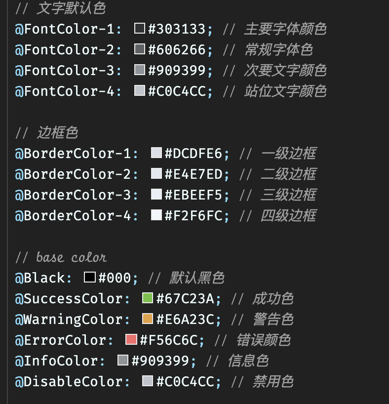

<!--
 * @abstract:
 * @version:
 * @Author: bhabgs
 * @Date: 2019-11-06 16:37:55
 * @LastEditors: 王晓龙
 * @LastEditTime: 2019-11-28 12:20:57
 -->
<!-- # 组件使用指南 -->

<p style="color: red; font-size: 50px; text-align:center; padding-top: 5rem;">
    我们不是vue的开发者，我们只是vue的搬运工
</p>

## 开发者须知

::: explain 介绍

::: tip 使用规范

> 该框架既定名称为 zx-pc-design less 存在层级关系，父级别定义的变量 通过`@import`能够 集成到子级别引用

1. 框架前缀名称要求
2. `style class` 类名为**z**开头 `例：z-button`
3. `.tsx` 组件名称 class 类 为大写的 Z 开头 `例: ZButton`
4. 组件文件夹命名 首字母应大写 `例: Button`
5. 主题颜色存放在 src/styles/theme/default.less
6. iconfont 在 index.less 下引入 每次更新图标后请及时更换在线地址
7. `@ActiveColor` 为默认主色调
8. eslint 配置禁止任何人更改 如代码有要求更改，请及时协商更改 `eslintignore、eslintrc.js、 .babelrc`

:::

## 提交操作

::: explain 提交至暂存区

`git add -A`：提交所有被删除、被替换、被修改和新增的文件到数据暂存区 <br/> `git add .`：提交所有修改的和新建的数据暂存区 <br/> `git add files`：按文件提交至暂存区 <建议> <br/>

:::

---

::: explain 创建 commit-id

使用 `git add files` 给不同的修改文件创建不同的 commit-id(美观)

::: ::: explain 更新其他子分支代码到本地分支

1. `git fetch origin master`: 更新至本地分支
2. `git log -p FETCH_HEAD`: 查看更新内容 <可忽略>
3. `git merge FETCH_HEAD` : 将拉取下来的最新内容合并到当前所在的分支中

:::

---

::: explain 把本地分支代码提交至远程分支

`git push origin branch` `git push`

:::

---

## 组件开发

::: explain vue 组件

> 组件的开发方案需要在 src/components 建立自己的组件文件夹，以 vue 官网组件开发方式开发即可，支持 tsx 开发方案，组件支持自动引入。

```javascript
// 注意组件定义格式目前组件名字应为 z-{any} 名字
<template>
    <div>test component</div>
<template>
<script>
export default {
    data() {
        return {

        }
    }
}
</script>
// tsx 组件
export default class Zui extends {

}
// Zui 为组件名称 也就是组件调用名称
```

:::

---

::: explain vue 工具

> 工具的开发方案需要在 src/packages 建立自己的包文件夹，可采用 ts 方案开发，包的到处方案是在包的根目录下建立 index.ts。

:::

---

::: explain style 格式

> 类名定义前缀全部以 z 开头
>
> 1. 避免与其他框架名字重复
> 2. 方便统一修改
> 3. 框架统一性



```less
.z-button{

}
.z-{any} {

}
```

:::
