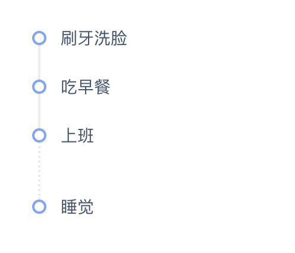

<!--
 * @Description:
 * @Version: 0.0.1
 * @Author: 王晓龙
 * @Date: 2019-11-12 10:53:37
 * @LastEditors: 王晓龙
 * @LastEditTime: 2019-11-13 09:44:58
 -->

# `timeline` 时间轴

## Features

::: warning 实现功能

1. 可自定义时间轴节点 可更改颜色
2. 可更改时间轴线的颜色和类型
3. 可更改时间节点顺序
4. 可自定义时间轴文字内容

:::

## Demo

-   ### 基础用法

    <templates-demo name="timeline-demo1">
    <<< @/vuepress/.vuepress/components/timeline/demo1.vue
    </templates-demo>

-   ### 节点&线样式

    <templates-demo name="timeline-demo2">
    <<< @/vuepress/.vuepress/components/timeline/demo2.vue
    </templates-demo>

-   ### 节点顺序

    <templates-demo name="timeline-demo3">
    <<< @/vuepress/.vuepress/components/timeline/demo3.vue
    </templates-demo>

-   ### 自定义 dot 插槽

    <templates-demo name="timeline-demo4">
    <<< @/vuepress/.vuepress/components/timeline/demo4.vue
    </templates-demo>

-   ### 自定义内容插槽

    <templates-demo name="timeline-demo5">
    <<< @/vuepress/.vuepress/components/timeline/demo5.vue
    </templates-demo>

## API

-   ### timeline

    | 参数    | 描述                               | 类型    | 是否必填 | 可选值        | 默认值 |
    | :------ | :--------------------------------- | :------ | :------- | :------------ | :----- |
    | reverse | 节点排序方向，默认为 false => 正序 | boolean | false    | true \| false | false  |

-   ### timeline-item

    | 参数      | 描述                 | 类型   | 是否必填 | 可选值                          | 默认值  |
    | :-------- | :------------------- | :----- | :------- | :------------------------------ | :------ |
    | title     | 指定时间轴的标题     | string | false    | -                               | -       |
    | content   | 指定时间轴的文字内容 | string | false    | -                               | -       |
    | dotColor  | 指定时间轴节点的颜色 | string | false    | -                               | #DCDFE6 |
    | lineColor | 指定时间轴线的颜色   | string | false    | -                               | #DCDFE6 |
    | lineType  | 指定时间轴线的类型   | string | false    | 'solid' \| 'dashed' \| 'dotted' | 'solid' |

-   ### timeline-item slot

    | 参数    | 描述                 |
    | :------ | :------------------- |
    | dot     | 自定义时间轴节点     |
    | content | 自定义时间轴文字内容 |

<!-- ## Example

 -->
